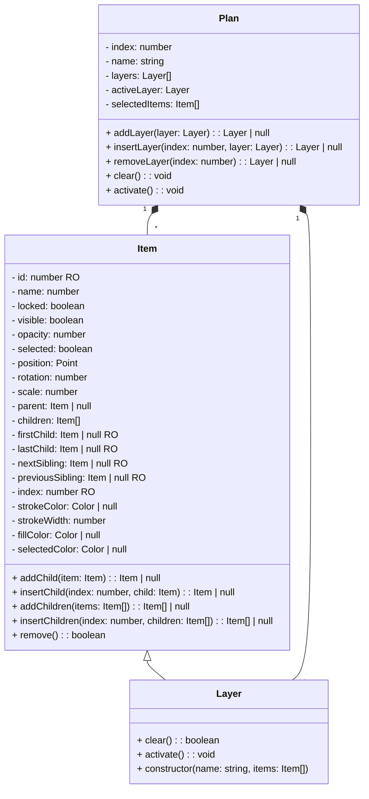

# Plan Architecture

## Observer Pattern

[Observer Pattern](https://refactoring.guru/design-patterns/observer)

[Inkscape architecture](https://wiki.inkscape.org/wiki/Architectural_overview)

## Classes

* Editor
* Plan
* Layer
* Item

### Plan

